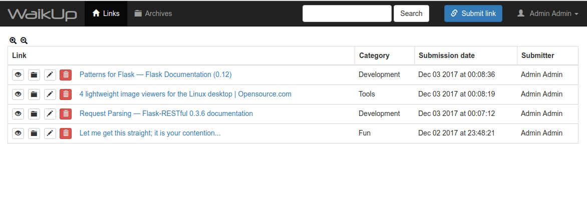
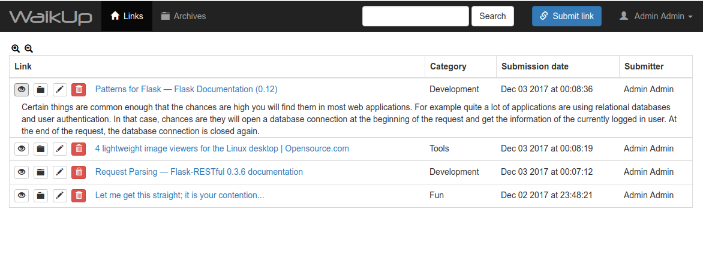
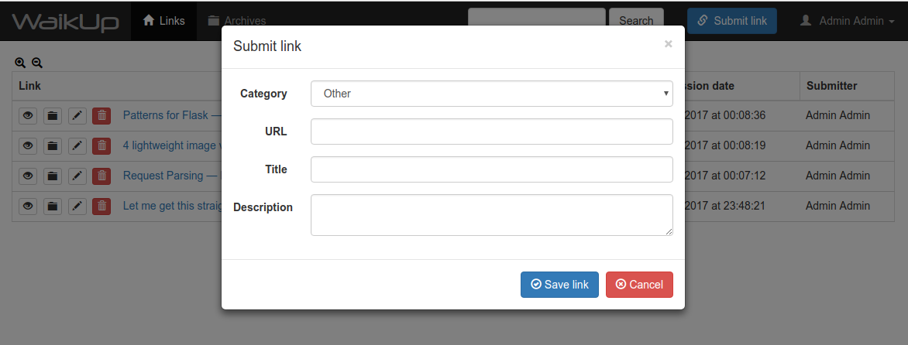
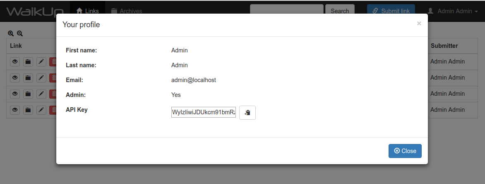

TODO: badges, plenty of them

# WaikUp
Collaborative news sharing platform.

## Introduction
WaikUp is an application to share links found around the Web with a group of people.
It is written in Python using the Flask framework.

Additionally to the traditionnal web interface, WaikUp provides a RESTful API to allow
interacting with the application programatically.

## Screenshots

Links list:


Expanded link description:


Link submition:


User profile:


## Dependencies
* Python2
* A bunch of Python modules (see [`Pipfile`](Pipfile "Pipfile") for details)

## Management utility
The documentation for management commands is available [here](docs/MANAGEMENT.md "Management 
commands")

## API
The API documentation is available [here](docs/API.md "API documentation").

A Javascript library for the API is available in `waikup/static/js/WaikupAPI.js`, and can
be used either included from the server (`https://waikup-host/static/js/WaikupAPI.js`).

## Deployment

### Docker
The project provides a `Dockerfile` as well as a `docker-compose` configuration for easier
deployment. A `Makefile` is also provided to abstract image creation and container execution.

The following `make` targets are available:
* `build` (default) - builds a `mdeous/waikup:latest` image
* `run` - runs `docker-compose` with a waikup+nginx+postgresql+postfix stack

### Manual deployment
A dedicated documentation page is available [here](docs/DEPLOY.md "Deployment documentation").

### Development environment
To create a development environment, the only mandatory dependency is a properly configured
Postgresql server with the correct database and user created. The SMTP server is only required
to test email distribution.

Once the Postgresql server is up and running (see deployment documentation for details),
the development environment can be created using the following commands:

```bash
pipenv install -d  # creates the virtulenv and installs dependencies
pipenv shell  # activates the virtualenv
python manage.py setupdb  # create database structure
python manage.py adduser --admin  # create a new administrator
python manage.py runserver -r -d  # start Flask development server
```

### Sending emails
Emails can be sent using the `./manage.py sendmail` command, if you want to automate this, 
just set a `crontab` entry to run this command periodically (make sure to run it using the 
virtualenv's Python interpreter, this can be done with pipenv: `pipenv run ./manage.py sendmail`) 
When running this command, all active emails will be archived.

### Settings
**IMPORTANT: `SECRET_KEY` and `SECURITY_PASSWORD_SALT` should be replaced with random
values for production use**

Default settings value are stored in the `waikup/settings.py` file. These values can be
overriden by creating a `prod_settings.py` file in the same directory and storing custom
configuration values in this file.

The `settings.py` file doesn't contain every available setting though, for a complete list,
please refer to Flask and used plugins documentation (see [`Pipfile`](Pipfile "Pipfile") for 
plugins list).

A table describing every setting available in the `settings.py` file, its default value, 
and the environment variable from which they can alternatively be set, is available
[here](docs/SETTINGS.md "Settings list").

## Issues and contributions
If you encounter any bug, or think a particular feature is missing, feel free to open a
ticket, or even better, fork the repository and make a pull request with your changes! ;)

### Version control workflow
Development of this application and its features (try to) follow the `git-flow` workflow,
to ensure features' code is separated from the stable (`master`) branch, and stable code
remains, well... stable!

tl;dr:
* `master` always contains the latest **stable** version.
* `develop` is the most often updated branch, it contains the latest **development**
(but working) version, and should not be considered ready for production.
* New features are developed in a `feature/<feature-name>` branch, and are merged into
`develop` once they're ready.
* Important bug fixes are done in a `hotfix/<fix-name or issue ID>`, and are merged into
`develop` once they're ready.

The complete workflow is explained in details on
[this page](http://nvie.com/posts/a-successful-git-branching-model/ "A successful branching model"),
and the `git-flow` utility can be found [here](https://github.com/nvie/gitflow "Git-Flow").

## Licensing
This project is licensed under the GNU General Public License v3.
